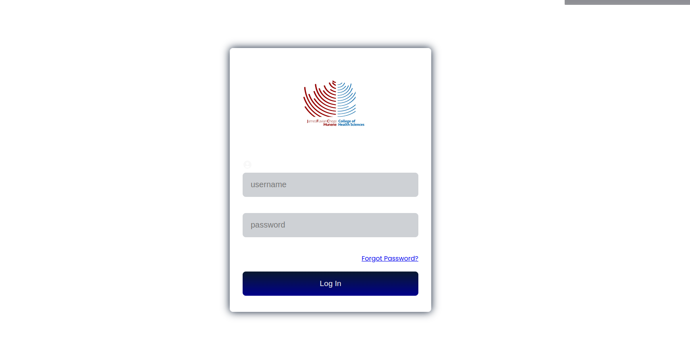

Sure, here's a basic structure for your README.md file:

```
# Learning System with React Vite

## Overview

This project is a learning system developed using React Vite. It provides separate interfaces for administrators, trainers, and students, allowing each user type to access relevant features and functionalities.


## Features

- **Admin Interface**: Dashboard, User Management, Course Management, Analytics.
- **Trainer Interface**: Dashboard, Course Management, Student Progress Tracking.
- **Student Interface**: Dashboard, Course Enrollment, Course Catalog, Grades & Feedback.


## Folder Structure

```

## PAGES SCREENSHOT
### Login Page



### Trainedr Dashboard

- src
  - assets
    - images
    - styles
      - global.css
  - components
    - Auth
      - Login.js
    - Admin
      - Dashboard.js
      - ManageUsers.js
      - ManageCourses.js
      - Analytics.js
    - Trainer
      - Dashboard.js
      - MyCourses.js
      - CreateCourse.js
      - StudentProgress.js
    - Student
      - Dashboard.js
      - MyCourses.js
      - CourseCatalog.js
      - GradesFeedback.js
    - Common
      - Navbar.js
      - Footer.js
  - pages
    - Auth
      - LoginPage.js
    - AdminPage.js
    - TrainerPage.js
    - StudentPage.js
  - utils
    - api.js
    - auth.js
  - App.js
  - index.js
```

## Usage

1. Clone the repository:

```
git clone https://github.com/yourusername/learning-system.git
cd learning-system
```

2. Install dependencies:

```
npm install
```

3. Run the development server:

```
npm run dev
```

4. Open your browser and navigate to `http://localhost:3000` to view the application.

## Contributing

Contributions are welcome! If you'd like to contribute to this project, please follow these steps:

1. Fork the repository.
2. Create a new branch (`git checkout -b feature/new-feature`).
3. Make your changes.
4. Commit your changes (`git commit -am 'Add new feature'`).
5. Push to the branch (`git push origin feature/new-feature`).
6. Create a new Pull Request.

## License

This project is licensed under the MIT License. See the [LICENSE](LICENSE) file for details.

```

Feel free to customize this template according to your project's specific details and requirements!# jfc_munene
